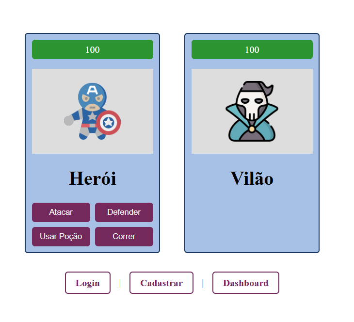
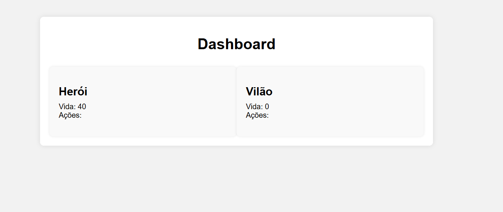
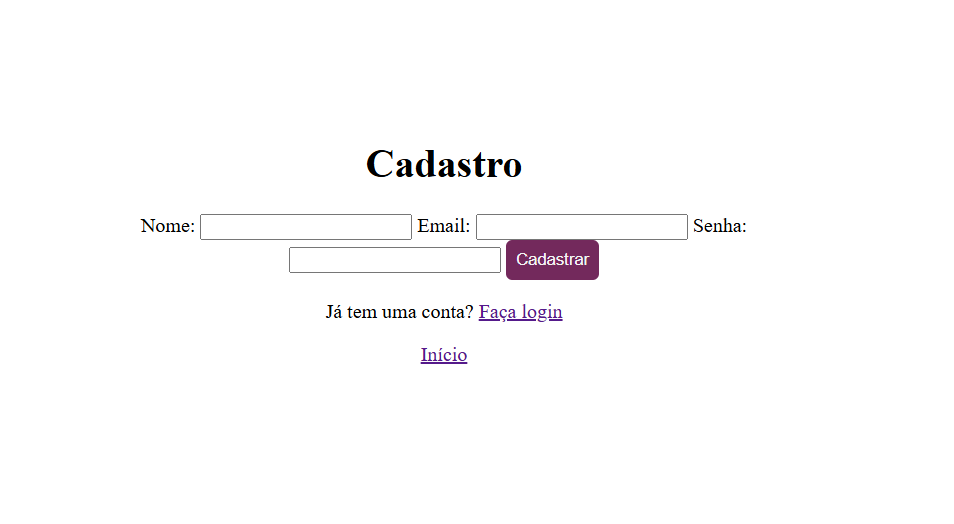
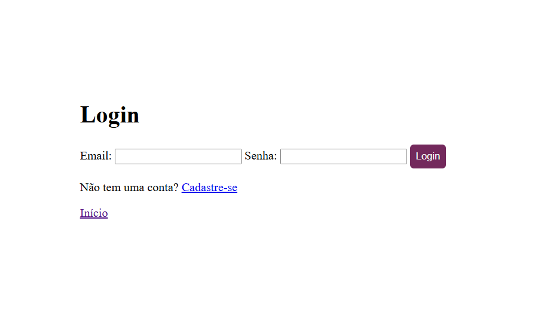

# Jogo Herói e Vilão
Este é um simples jogo de batalha entre um herói e um vilão, onde eles podem executar diferentes ações para lutar um contra o outro. O jogo inclui uma interface de usuário para visualizar o estado atual dos personagens e suas ações disponíveis.

# Funcionalidades
Os jogadores podem ver a vida atual do herói e do vilão.

Os jogadores podem ver as ações disponíveis para o herói e para o vilão.

Os jogadores podem realizar ações como atacar, defender, usar poção e correr.

As ações do vilão são determinadas com base em probabilidades.

# Tecnologias Utilizadas
Frontend: Vue.js

Backend: Node.js com Express

Banco de Dados: Azure

# Instalação e Uso

Clone este repositório: git clone <URL_do_repositório>

Instale as dependências do servidor: npm install

Navegue para o diretório do servidor: cd server

Instale as dependências do cliente: npm install

Navegue de volta para o diretório raiz: cd ..

Execute o servidor: npm start

Abra o navegador e acesse http://localhost:3000 para jogar o jogo.

# Acessar o jogo hospedado (sem o banco de dados):

https://jogoheroievilao.netlify.app/

# Telas de demonstração

# Autor
Jorge Luiz Patrocínio dos Santos
